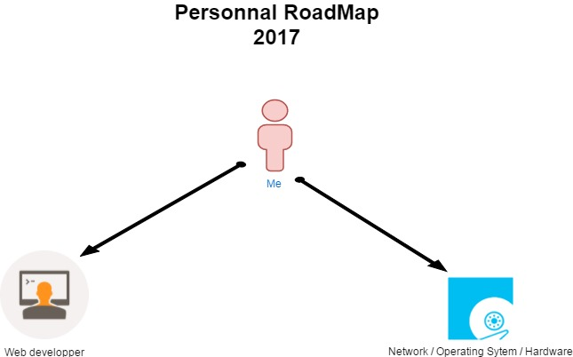
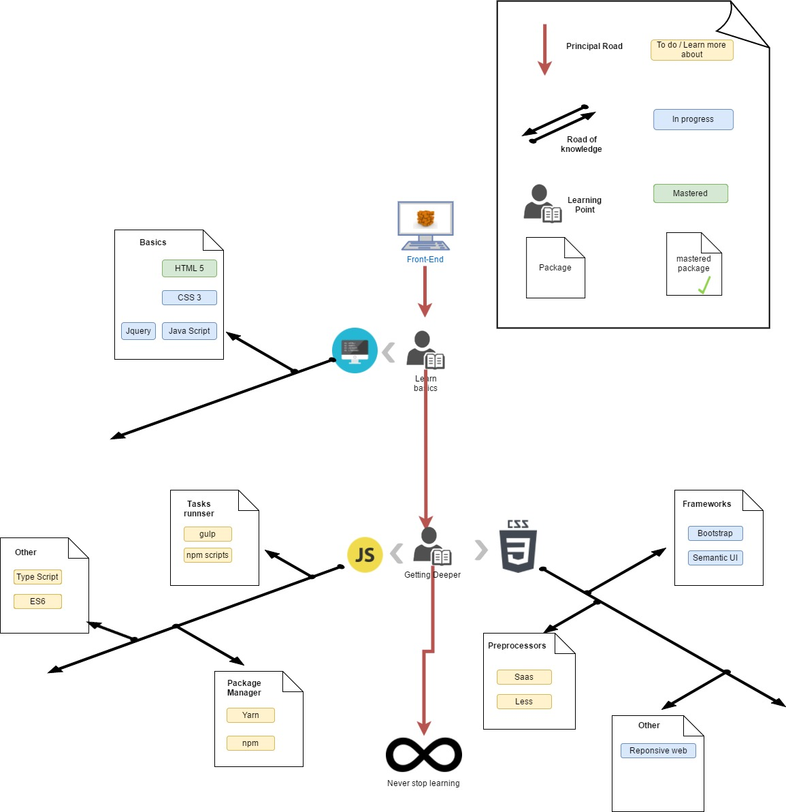
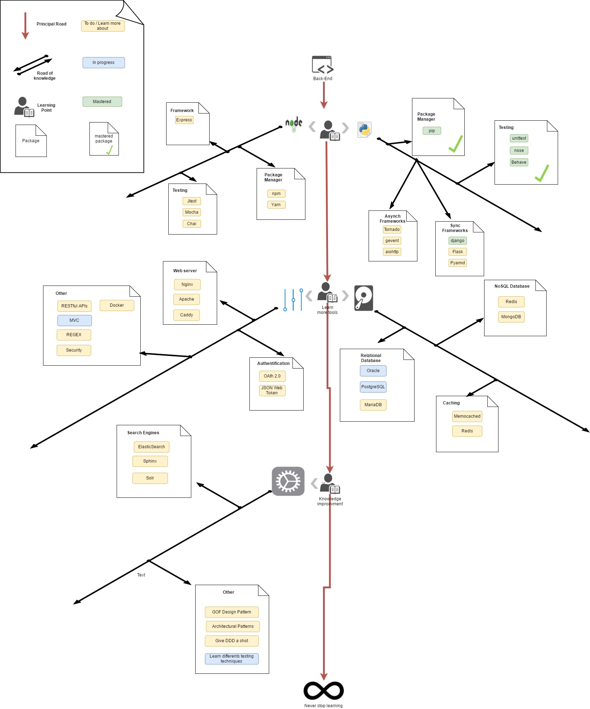
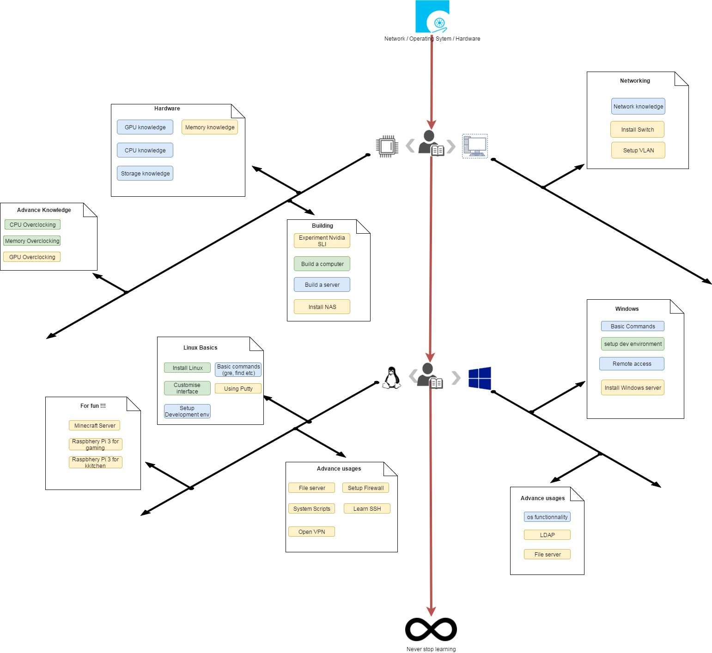

# Introduction

This page goal is to present my objectives and personal interest as a developer junior in 2017. 
First of all I will introduce my personal interest, and finished by presenting my Roadmap.

# Personal interest 

  ## Video Games
  Since my young ages, I have a passion for video games. These last few years, I played a lot of video games, principally on my computer. I love every kind of video games, that’s why I would like to work on a web application create for gamers needs. Moreover wish I could find some Free, Open source projects to contribute.

  ## Hardware
  Since my first years of computing I wish to increase my Hardware’s skills. That’s why I would like to build my own gaming computer.
  Today I wish to push my experience further by building my own network architecture (Firewall, VLANs, and Virtual Machine).
	
  ## Development
  	
  Today I worked as a Junior Web Developer, I had an introduction to web development with Python Django Framework, and today I wish to improve my skills. So, as you can notice to my roadmap, my principal point of interest is Back-End development, but It also required some Front-End knowledge.

# Personal Roadmap
	
  This Roadmap is a global guidance to the technologies I had to learn this year. It’s not an exhaustive goal, because computing always evolves. And my work also allows me to improve my skills.
So this Roadmap for 2017 can actually evolve in function of my skills improvement and my objectives. I also added my path for Hardware / network Knowledge I would like to learn.

#Global

#Front-End

#Back-End

#Network / Hardware

